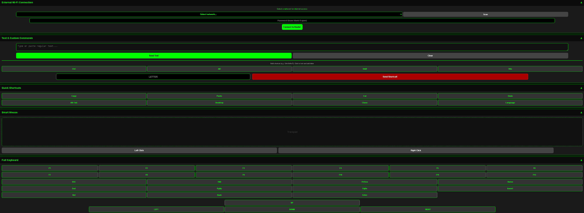

# Wi-Fi Remote Keyboard & Mouse (CircuitPython + LILYGO T-Dongle-S3)

This is a CircuitPython project that turns a Wi-Fi-enabled microcontroller (like a Raspberry Pi Pico W or ESP32-S3) into a wireless USB keyboard and trackpad. 

When plugged into a computer, the board acts as a standard USB HID device. At the same time, it hosts a local web server. You can open this web interface on your phone to send text, use a virtual trackpad, and trigger custom key combinations. It also includes support for an ST7735 LCD screen that displays the network status in a cyberpunk/terminal style.

## Screenshots

## Screenshots

  
  &nbsp;
  

## Features

- **Web-Based Controller**: Send regular text, move the mouse, and click using a mobile-friendly web interface.
- **Shortcut Builder**: Easily combine modifier keys (Ctrl, Alt, Shift, Win) with any letter directly from the UI.
- **Standalone or Networked**: By default, it broadcasts its own Access Point (`Idan-Remote-KBD`). You can also use the web interface to scan and connect it to your home/office router.
- **Status Display**: Uses an ST7735 160x80 screen to show the current IP address, operating mode, and connection status in a retro terminal design.

## Hardware Requirements

- A microcontroller with Wi-Fi and native USB HID support (e.g., LILYGO T-Dongle-S3).
- ST7735R TFT Display (160x80).
- USB data cable (if not using a direct dongle).

## Dependencies

Make sure you have a recent version of CircuitPython installed on your board. You will need to drop the following libraries from the Adafruit bundle into your board's `lib` folder:

- `adafruit_hid`
- `adafruit_display_text`
- `adafruit_st7735r`
- `adafruit_httpserver`

## Installation & Setup

1. Copy the required libraries into the `/lib` directory on your `CIRCUITPY` drive.
2. Drop the main script into the root of the drive and name it `code.py`.
3. Plug the board into the target computer. The computer will recognize it as a standard keyboard and mouse.
4. On your phone, connect to the `Idan-Remote-KBD` Wi-Fi network (default password: `12345678`).
5. Open your browser and navigate to `http://192.168.4.1` to access the remote.

*Note: If you connect the board to an external Wi-Fi router via the web interface, the LCD screen will update to show the new local IP address assigned by your router.*

## Pin Configuration (Display)

The script assumes specific GPIO pins for the SPI display. You might need to change these in `code.py` depending on the exact board you are using. Current configuration (for LILYGO T-Dongle-S3):

- **CLK (Clock)**: GPIO5
- **MOSI**: GPIO3
- **CS (Chip Select)**: GPIO4
- **DC (Data/Command)**: GPIO2
- **RST (Reset)**: GPIO1
- **Backlight**: GPIO38

## Usage Notes

- **Language Support**: The script includes a custom mapping dictionary to handle Hebrew text input alongside standard English characters.
- **Mouse Sensitivity**: The trackpad movement multiplier is set to `1.5` in the JavaScript code. You can adjust this in the HTML block if the mouse moves too slow or too fast for your liking.
